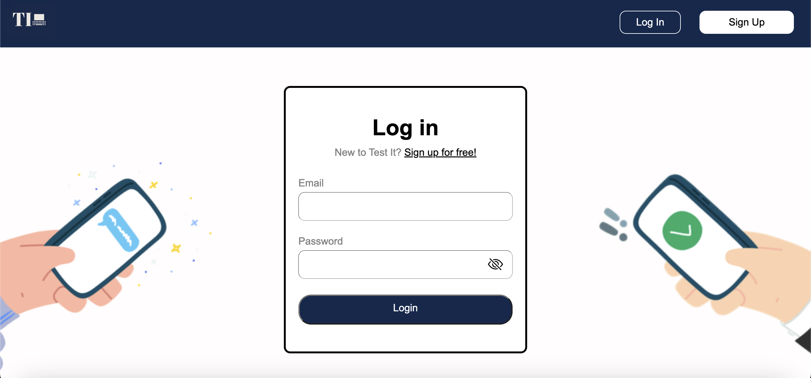
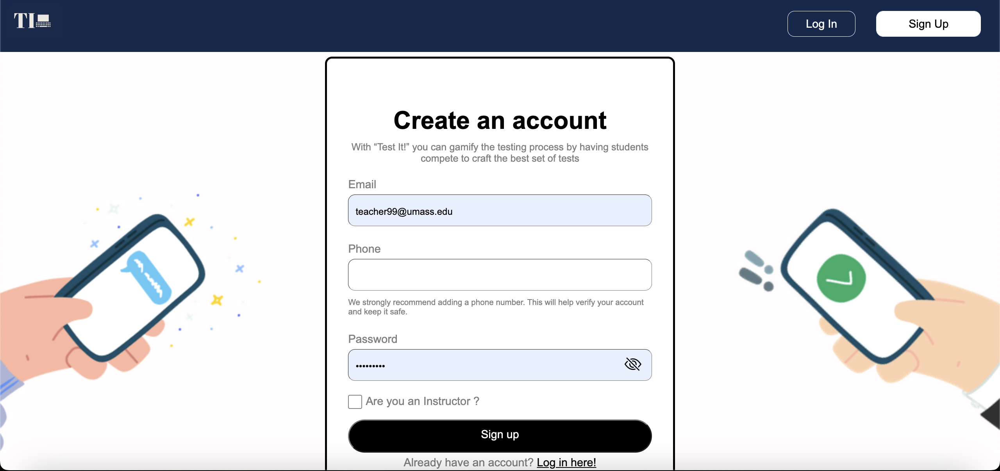
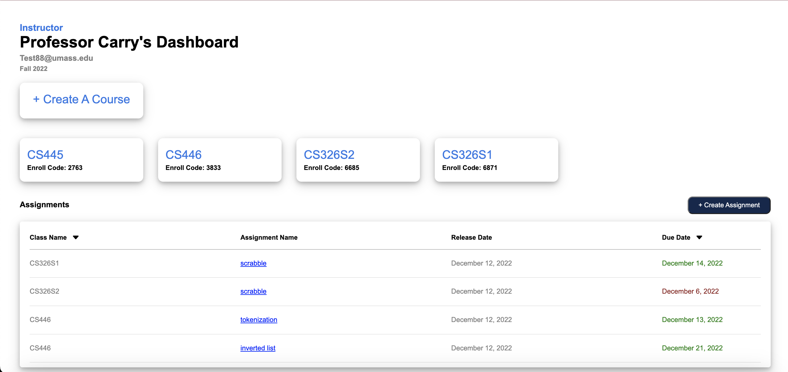
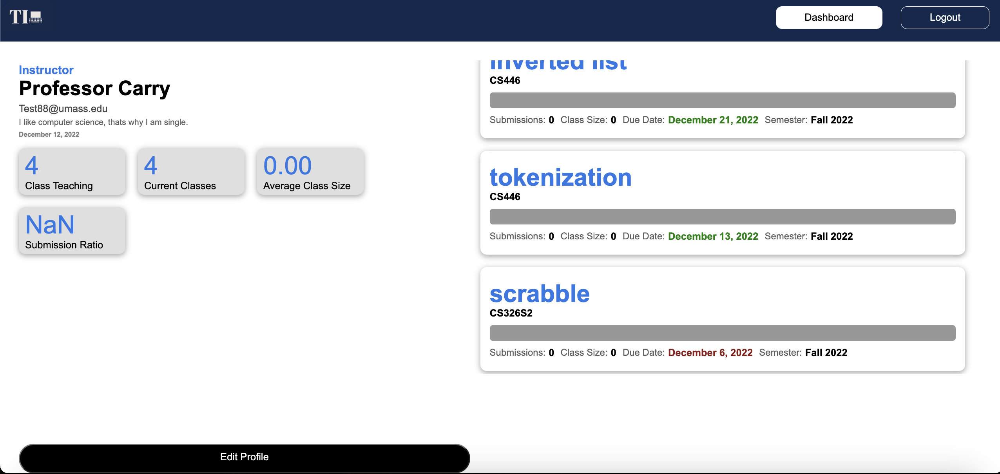
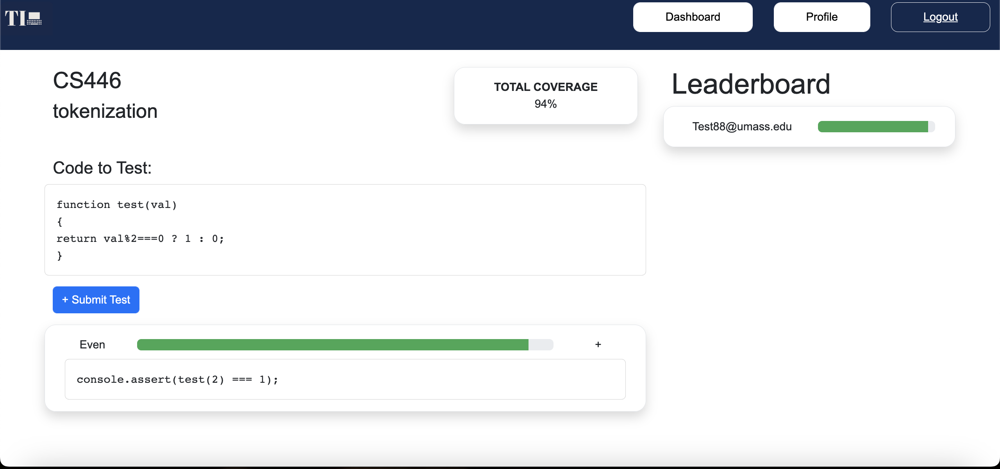

# Team Chi

## Test It!

### Fall 2022

### Overview
“Test It!” gamifies the testing process by having students compete to craft the best set of tests that will provide as much code coverage or bug discovery as possible. Students join a classroom on the site, and will see a list of all the projects assigned by a teacher. They can write and submit their tests under the projects. The tests are rated in terms of their coverage with automated systems (as you choose what sort of coverage there should be). Their tests are compared with the coverage and rated in terms of that. Once the project period is up, a leaderboard is released of students’ ranking and the tests are released for people to compare. The points assigned to the students’ final results can then be used for any reward system such as extra points in grading. This is primarily a learning tool to encourage students to make tests that have good coverage via competition.

### Team Members
Maheen Hussain - @VariableV
Kanishk Chaudhary - @KanishkC9 and @Kanishk-Chaudhary(this alias was not connected properly so it doesn’t show in contributors, please check pulse for this)

### User Interface

Login Page - Email field should be validated for UMass email. Password field should validate basic security requirements (upper case, length, numbers). Users get redirected to this page when their session expires.


Signup Page - Signup form data on sign up page should be collected and sent to server for user creation. Ticking the checkbox for the instructor should create two different types of accounts which reflects the type of user created.


Dashboard Page - For instructors, this page enables them to create new classes for a semester and assignments for the classes they are teaching. Instructors are also able to use the assignment grid for checking in the status of assignments like their released date , due date etc. For students this page serves the purpose of enrolling into classes and using the assignment grid to keep up with their homework assignments.


Profile Page - This page represents different stats for both students and instructors. For instructors, it shows all the assignments that the instructor has created and its stats like submissions , class size etc. For students it shows all the test cases that the student has created and its stats like coverage , className etc.  This page also provides user stats like for instructors it will show things like submission ratio and while for the students it will show average class size, coverage etc.


Assignment Page - This page shows an assignment for a particular class. This will show the test function that the student will write their tests on spit out scores for that. These scores are then used to populate the leaderboard on the right which shows the highest scoring users for that assignment.

### APIs
/loginUser - POST request which needs email and password in body to log the user in
/createStudent - POST request which needs email and password in body to create a student
/createInstructor - POST request which needs email and password in body to create an Instructor
/createClass - POST request which needs name of the class and email of the instructor teaching in body to create a class and provide an enroll code
/createAssignment - POST request which needs assignmentName className classEnrollCode dueDate releasedDate testFunction and correctFunction in body to create an assignment for a particular class. 
/createTestCase - - POST request which needs name studentEmail className assignmentName and code in body to create a TestCase for a particular Assignment. 
/updateUser - POST request which needs an email and bio to update user’s profile
/enrollClass - POST request which needs enrollCode and studentEmail to enroll the student in a class and update the class size

/logout - Destroys the current session and redirects the user to the login page

/getUser/:email - GET request that gets the user’s details , like name, bio, classes etc.
/getClass/:class - GET request that gets additional information for a class like classSize, Assignments, instructor etc.
/getClassByCode/:enrollCode - GET request that gets additional information for a class using the unique enroll code.
/getAssignments/:class - GET request that gets all the assignments of a particular class
/getAssignment/:class/:assignment - GET request that gets a particular assignment of a particular class
/getTestCases/:class/:assignment - GET request that gets all the TestCases for an assignment in a particular class

### Database
We used MongoDB to manage our data needs. The documents used by our API are described below:
```
user document {
    _id: <ObjectId>, // unique id for user
    email: String, // email for user
    name: String, // name of user, optional field
    bio: String, // bio of user, optional field
    studentAccount: Boolean, // True for student, False for Teacher
    classes: Array<String>, // classes teaching or enrolled in
    joined: Date // join date
}

test document {
    _id: <ObjectId>, // unique id for test
    name: String, // name of test
    student: String, // which student test is associated with
    class: String, // class test is associated with
    assignment: String, // assignment test is associated with
    coverage: Integer, // percent coverage
    code: String // block of code for a test
}

class document {
    _id: <ObjectId>, // unique id for class
    name: String, // name for class
    assignments: Array<String>, // unique assignments in class
    instructor: String, // teacher name
    size: Integer // size of class
    enrollCode: String // required for enrolling in a class, must be provided by an instructor.
}

assignment document {
    _id: <ObjectId>, // unique id for assignment
    name: String, // name for assignment
    class: String, // class that assignment belongs to
    release: Date, // release date for assignment
    due: Date // due date for assignment
}
```

### URL Routes/Mappings
/login - Route to the login page
/signup - Route to the sign up page
/dashboard - Route to the instructor/student dashboard containing information about classes, enrolling in them, and assignments. Protected by user authentication.
/profile - Route to the profile page containing biographical information about the user and different statistics. Protected by user authentication.
/assignment/:class/:assignment - Route to the specific assignment page a user can submit and view their tests in. Protected by user authentication.

### Authentication/Authorization
We have used server side authentication in our web application using express. We have made sure that a user who is not authenticated cannot access pages other than the login and signup. When the user logs in, A session is created which has a maxAge of 600,000 (10 mins). When the user logs out that session is destroyed. If the user session expires then the user will be redirected to the login page and prompted to log in.

### Division of Labor
Maheen Hussain - Pitched the idea and the basic functionality. Designed wireframe for assignment view and student dashboard. Worked on front-end code for the assignment page interactions and laid things out with Bootstrap. Setup the back-end server and express endpoints. Designed the database schema and integrated the models with express server. 
Kanishk Chaudhary - Designed wireframe for login/signup, profile page, and instructor dashboard. Wrote out  front-end code for profile page, dashboard and login/signup. Wrote various endpoints used by front-end pages and implemented database interactions with MongoDB. Setup authentication while working on login/signup.

### Conclusion
Overall this project gave us a good understanding of the need to work collaboratively and working together to get through different challenges we face. As we went through the design process from wireframe to the final product there were quite a bit of changes from our original concept that were a result of our time limitations, and team member limitations (as one of our members did very little to contribute towards the final deliverable). The technical process allowed us to deepen our understanding of how to piece together different aspects of the production stack, from the basic front-end to the back-end and also database. One thing that we would’ve liked to have more time or a better grounding of is general application security and authentication which we saved until the end and crunched to get done.

### Points Breakdown
|**Pages**|Points Received|Possible Points|Description|
| :- | :- | :- | :- |
|**Signup Page**||| Email field should be validated for UMass email. Password field should validate basic security requirements (upper case, length, numbers). Signup form data on the sign up page should be collected and sent to the server for user creation. Ticking the checkbox for the instructor should create two different types of accounts which reflects the type of user created.|
|Can create new account.||5||
|Credentials & form validation  ||5||
|**Login Page**|||Login form email field should be preliminarily validated for UMass email. Password field should be preliminarily validated for basic requirements in the signup process. Password field visibility button should work according to the toggle. Successful login should redirect user to the dashboard home. Unsuccessful authentication should yield an error message while remaining on the same page.|
|Can login to existing acc.||5||
|Credentials & form validation  ||5||
|**Dashboard**|||Should show user details, classes, and assignments. Class and Assignment buttons should open up a modal for users to put info in. Assignments grid should be dynamic, so if the user enrolls in a new class, new  assignments should be appended to the grid. Classes grid should be dynamic, so if a user enrolls or creates a class, classes grid should reflect the new changes. Creating a class should provide the instructors with an enroll code.|
|All UI elements functional||5||
|Can create classes and Assignments (if instructor) , Can enroll in classes ( if student)||10||
|Sorting Assignments and UI Styling||10||
|**Profile**|||Should show user details, stats, and test-cases if student, assignments if instructor. Edit profile button should open up a modal where users update their information.|
|Profile is editable and UI Styling||10||
|User stats are correct, Assignments are shown for instructors and Tests are shown for students||15||
|**Assignment**|||Shows a leaderboard, displaying user and other student’s coverage for that assignment. Displays user defined tests, with coverage shown for each test.|
|Leaderboard shows accurate coverages||10||
|User test cases are given an accurate score when compared to instructor’s function||10||
|**Authentication**|||Users can signout whenever they want. After a period of inactivity, Users will automatically be logged out and will be prompted to sign in again.|
|Users can signout||5||
|Authentication||5||
|**Total**||100||