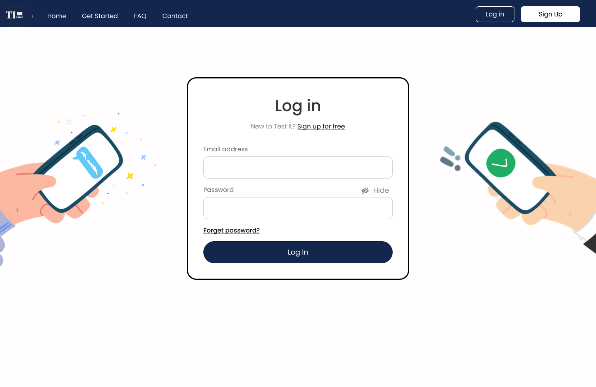
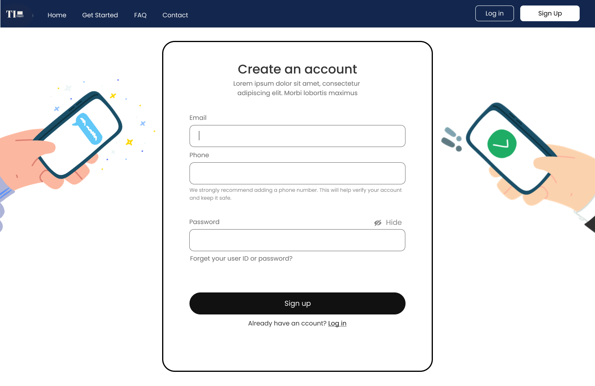
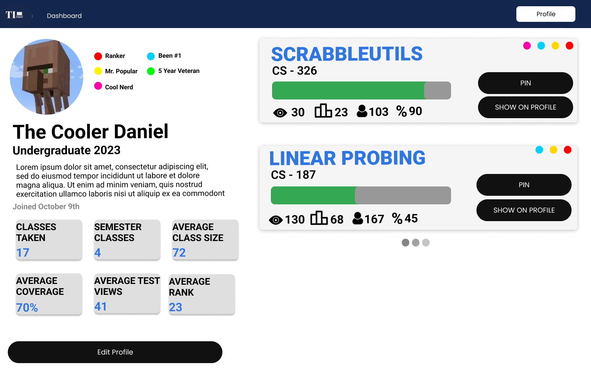
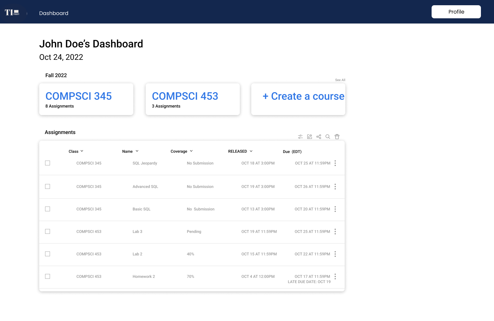
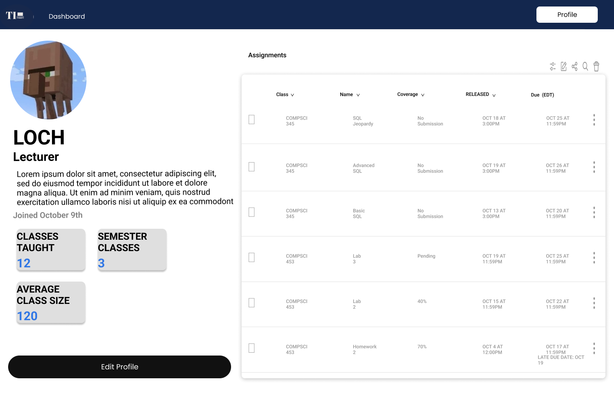
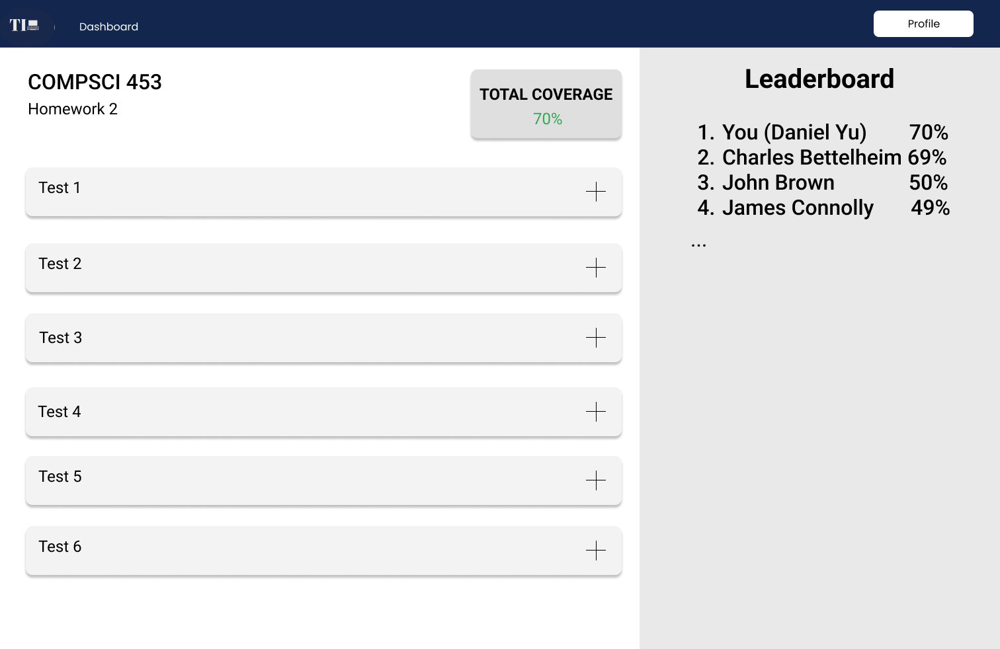

## Data Interactions

## Wireframes
Login - Basic login form

Create Account - Create account

Student Dashboard - Contains info about student assignments

Student Profile - Contains information about user statistics

Instructor Dashboard - Dashboard for teacher to deploy projects

Instructor profile - Contains information about professor statistics

Assignment Page - Has information about user's test submissions
