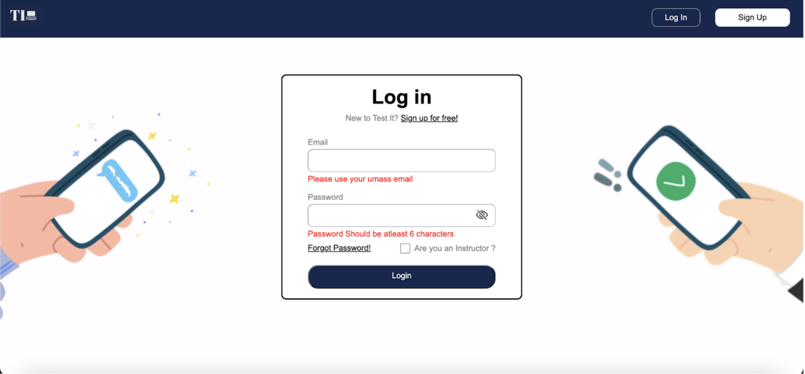
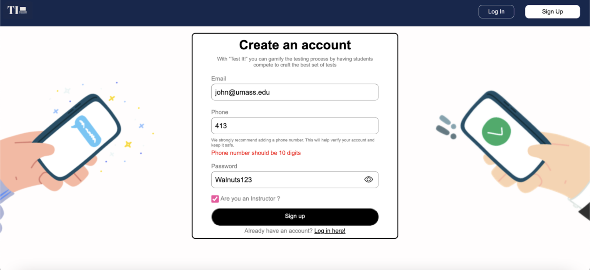
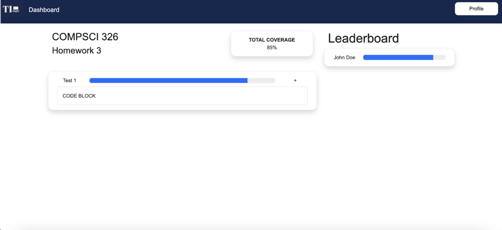
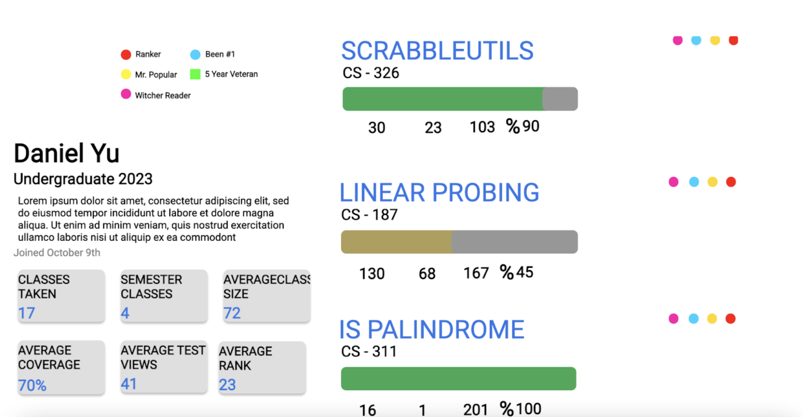

## API's for Test It!

We will have a students DB, instructors DB, and a classes DB.

The API structure will look as follows.

/getStudent (GET) - this endpoint will be used during login when a student logs into their test it account. This will return students’ information, and their classes. This will help us populate the profile and part of the dashboard frontend.

/createStudent (POST) - this endpoint will be used during signup when a new student signs up for testit. This will add the student to DB and log the user in. 

/getInstructor (GET) - works similar to /getStudent but this time it returns the instructor's information and classes teaching.

/createInstructor (POST) - works similarly to /createStudent. This will add the instructor to the DB and log the instructor in.

/createClass (POST) - will create a class. An instructor can only do this. This will add the new class to class DB.

/createTestCase (POST) - this will create a new test case in a particular class. A student can only do this. This will update the class DB JSON tree (No SQL)

The above APIs could be modified once we actually delve deep into the backend but the structure will be the same. 
We will also implement a store so that we don't call the APIs that we have already called in that session

## Client Interface

The above image shows the login page. Users can log in to their test-It account here. We have also done form validation here as well. Both the Email and Password fields cannot be empty when trying to login,
users having a valid UMass email can use test-it, and Password should be at least 6 characters long and must have an uppercase character and a number.

The above images show the signup page. Users (both instructors and students) can create new accounts here. We have form validation here as well similar to the login page. We also have a new field called Phone. We recommend users add their phone numbers as this will enable secure authentication and help them in forgot passwords. We are also planning to add new fields so we know more about the user like grade , number of credits, etc.

The above page shows the dashboard for a particular class ( here CS 326 ). On the left side, we can see all the tests for homework in that class (currently 1), and on the right side is the leaderboard. The leaderboard shows students that have the best test cases for that homework. 

The above page shows the profile page. On the left side, we show the student's details and their overall stats and current stats. We collect these stats when the user enrolls in a class. We also show some badges on top, we provide these ourselves checking the leaderboard stats of all the classes the user is currently in. The right side shows a list of all their test cases from all the classes they have taken. We haven’t included images in this implementation as we are still checking if the DB will support images or not, but the main structure should not change. 

## The URL of your Heroku Application

https://final-team-chi.herokuapp.com/

## Division Of Labor

Kanishk -  worked on login, and signup pages.
Files worked on -
login.html, login.css, login.js, signup.html, signup.css, signup.js, server.js, appNavbar.js, appNavbar.css, loginNavbar.js, loginNavbar.css

Maheen - worked on the dashboard page.
Files worked on - 
assignment.html, assignment.css

Daniel - worked on the profile page
Files worked on-
student_profile.html, student_profile.css

